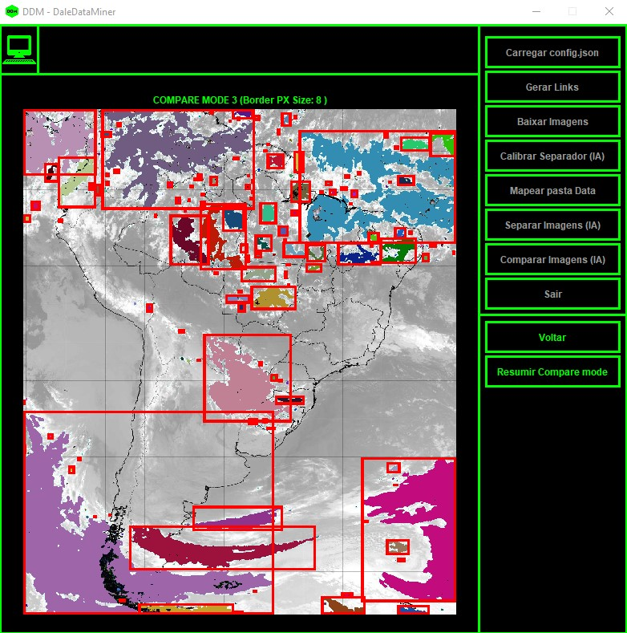

DDM - GOES 16 CH.13 - INPE (PT/BR) - AI - Data auto-downloader/manager, image recognition and pattern detection. For scientific analysis.
(Only avaliable for windows at this moment)
(EN interface yet to be released)

# **Download**

[download](https://github.com/Igordalessandro/DDM-AI-GOES16CH13/releases/download/Release/DDM.zip)  

# **Introduction**

  

 The DDM (Dalessandro data miner) GOES 16 (Geostationary Operational Environmental Satellites number 16) is a complete tool for downloading, storing, pattern detection and IA image processing for the GOES-16 pre-processed chanel 13 (ch13) products available at INPE (INPE - Instituto Nacional de Pesquisas Espaciais || Eng: National institute of aerospace research). This program was made to meet the needs of the UFRJ (Universidade federal do Rio de Janeiro || Eng: Federal University of Rio de Janeiro) - Department of Meteorology of the Institute of Geosciences at the Center for Mathematical and Natural Sciences. The DDM main features and workflow are as follow:

1 - DDM Generate all download links (.jpg images) by following the instruction of the configuration file (Config.json)  
2 - DDM Starts to download and store all images from the generated links.  
3 - DDM-AI Gets calibrated by the research team, trained crew, or laboratory technician.  
4 - DDM Start its to split all satellite images into individual atmospheric phenomena elements.  
5 - DDM Compares all available elements looking for patters and repetitions of elements.  
6 - Results containing the maped similar objects get stored in a json file.  

# **Tool Features**

1 - All the core instructions can be modified and calibrated by a research team to find better/usefull results.(config.json file)  
2 - All steps of this program are multithreaded. (This tool is CPU intensive.)  
3 - There is a fast-mode for calibration.  
4 - Calibration image can be changed from the calibrationImage Folder.  
5 - Both IA pattern detection and IA image processing can be customized.  
6 - To comply with the UFRJ Department of Meteorology laboratory crews, this tool does not use any form of database or database management system; it uses folders and subfolders instead. This is made in order to help out the crews that may need training to operate said database and database management tools.  
7 - The intire program has a reponsive GUI (Graphical user interface); all steps can be followed up and observed in real time.  
8 - The Data folder is able to recive outside input, there is no real need to download CH 13 images from INPE if you already have your own set.  

